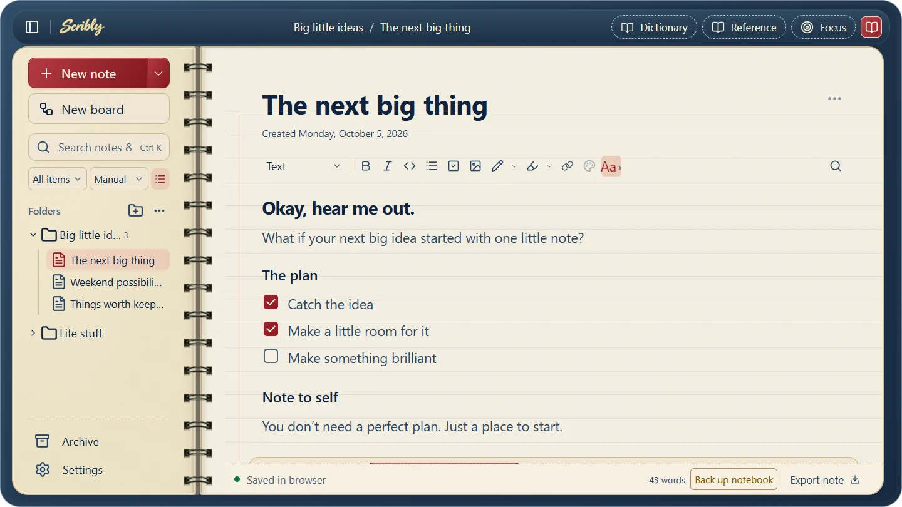
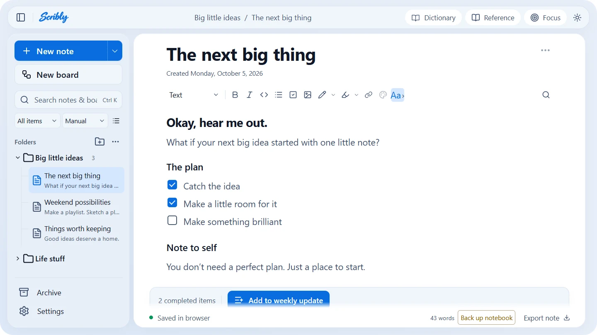
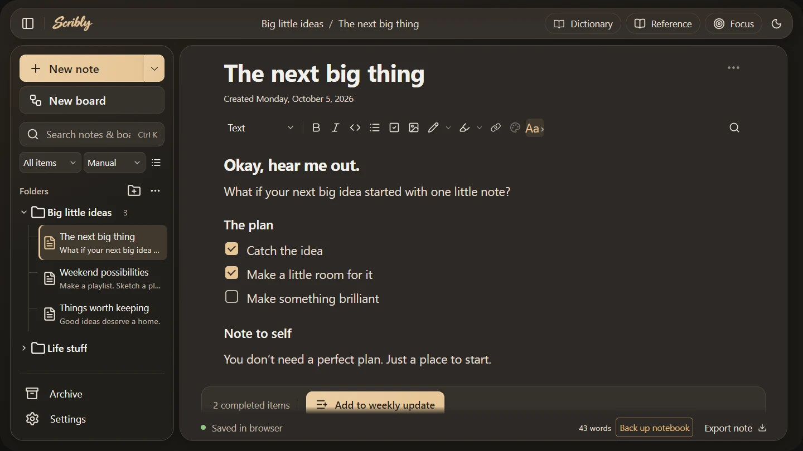
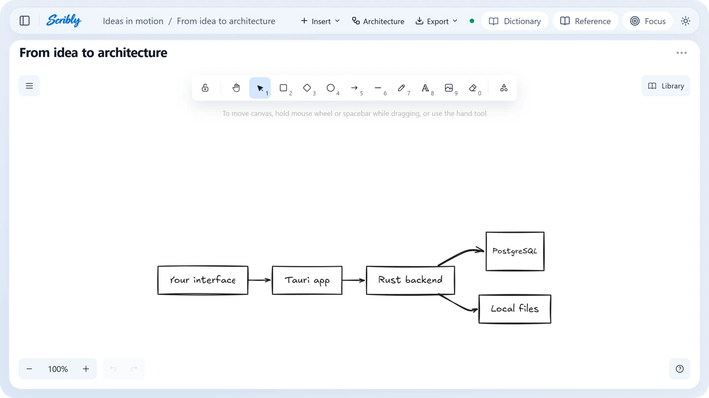
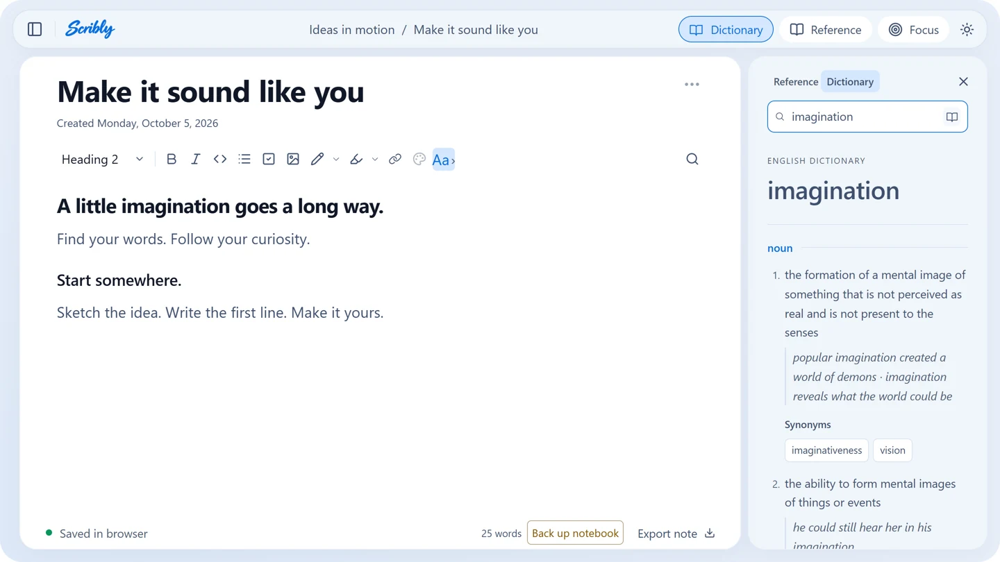

# Scribly

A free Windows notebook for your notes, ideas, and architecture diagrams. Write with a reference beside you, turn Mermaid flowcharts into editable Excalidraw boards, and find the right word with a built-in offline English dictionary. Your notebook stays on your computer; no account or cloud service is required.

**[Download the latest Windows release](https://github.com/Malon0825/scribly/releases/latest)** · [User guide](docs/user-guide.md) · [Contribute](CONTRIBUTING.md) · [Report a bug](https://github.com/Malon0825/scribly/issues)



## Make it yours

Choose **Light**, **Dark**, or **Notebook**, or let **System** follow your Windows appearance. Adjust interface and text size, and choose clean or handwritten note fonts, including Lato, Caveat, Itim, Gaegu, and Gochi Hand.

| Light | Dark |
| --- | --- |
|  |  |

## Sketch the architecture

Write a Mermaid flowchart, preview it, and create an editable Excalidraw board. Add shapes, connectors, templates, and offline brand logos; keep a board in Reference while you write.



## Find your words

Select an English word or open **Dictionary** to explore definitions, synonyms, and antonyms beside your note. WordNet 3.1 provides on-device lookup; unlisted words can use the Free Dictionary API online. Click a synonym or antonym to replace the selected word, and undo it normally.



Screenshots use demo notes in the browser preview and show source version 1.4.0; the desktop app saves locally on Windows. Check the release page for the latest published installer.

## Install

1. Open the [latest release](https://github.com/Malon0825/scribly/releases/latest) and download the `Scribly_*_x64-setup.exe` installer from **Assets**. The source ZIP is for developers.
2. Run the setup EXE. Scribly installs for your Windows account without administrator access.
3. Open Scribly from the Start menu.

Supports **Windows 10/11 x64**. Microsoft WebView2 is required; setup downloads it from Microsoft if it is missing, so first installation may need internet access. PostgreSQL is bundled: you do not need to install or configure a database.

The installer is **unsigned**. Windows may show an unknown-publisher or SmartScreen warning. Download from this repository's release page and use the supplied SHA-256 checksum to verify the file. Do not disable Windows protection.

To update, export a backup in Settings, close Scribly, and run the newer installer. Existing notebooks are retained. There is no automatic updater in this version.

## What you can do

- Organize notes in folders, search, reorder, move, archive, and duplicate them.
- Write rich text, code blocks, checklists, and notes with embedded images, selected-text colors, marker strokes, and pen drawing.
- Keep a read-only note or board visible in Reference, or use Focus mode for more writing space.
- Create Excalidraw boards, insert offline brand logos, import Mermaid, and export drawings, SVG, PNG, or Mermaid. Copy flowcharts for Miro.
- Import text, Markdown, code, selectable-text PDFs, and Word `.docx` files.
- Choose Light, Dark, or Notebook themes, follow Windows appearance with System, and adjust interface size and note typography.
- Look up English definitions, synonyms, and antonyms with the offline WordNet dictionary.
- Autosave locally and export/import portable notebook backups.

See the [user guide](docs/user-guide.md) for shortcuts and feature limits, and [version 1.4.0 notes](docs/releases/v1.4.0.md) for the dictionary, suggestions, and Notebook theme. New notebooks start with an Introduction folder and a getting-started note. Existing notebooks are preserved.

## Your data

The desktop app stores notes under `%LOCALAPPDATA%\com.still.notes\database`. Its bundled PostgreSQL server listens only on loopback, uses a random local port and an app-generated password, and stops when the app exits. Updates and uninstalling preserve the notebook folder. Export backups periodically from Settings; copying a live PostgreSQL folder is not a supported backup method.

Scribly is currently a personal notebook with **no cloud sync or shared editing**. The browser development preview uses IndexedDB and local storage and is separate from your desktop notebook.

## Word suggestions

While writing English prose, a subtle next-word suggestion appears at the end of a paragraph or heading. Type a space after a complete word to request the next word, or keep typing to complete a partial word. Press **Tab** to accept it or **Escape** to dismiss it. The **Next word suggestions** toolbar toggle remembers your preference. Suggestions stay outside saved notes, exports, and word counts until accepted, and acceptance can be undone normally. Code blocks, selected text, read-only Reference, drawing, and Find mode do not request predictions. Tab keeps its usual behavior when no suggestion is visible.

Suggestions use the [Datamuse API](https://www.datamuse.com/api/): frequent followers of the previous word, a typed prefix, and up to five recent topic words. These limited context words are sent to Datamuse; the complete note is not sent. Datamuse provides statistical context hints, not full sentence understanding. Requests are debounced, cancelled when stale, cached only in memory, and silently skipped on connection failure. Nearby topic words use a means-like constraint alongside frequent followers and left context; live checks showed that the topic-hint parameter fails with some frequent-follower queries. If semantic filtering fails, the request falls back to immediate context and frequent followers within the same time budget. API responses are not inserted automatically.

Datamuse currently allows up to 100,000 requests per day without a key. Its documentation announces that an API key will be required starting **January 1, 2027**. This integration will need key support before that date; no secret key should be embedded in a distributed frontend.

## Develop

For the browser preview, install Node.js **22.12+**:

```powershell
npm ci
npm run prepare:logos
npm run dev
```

Open `http://127.0.0.1:1420`. For the Windows app, also install Rust stable, Visual Studio C++ build tools, a Windows SDK, and WebView2:

```powershell
.\scripts\prepare-postgres.ps1
npm run tauri -- dev
```

Build an installer with `npm run package`. Run `npm run build` for the production frontend and `npm run check:rust` for native checks. Playwright tests are in `tests/`; install Chromium with `npx playwright install chromium` and run affected cases with `npm test -- tests/<feature>.spec.ts`. Consult [verification history](tests/verification.md) before repeating checks. See [CONTRIBUTING.md](CONTRIBUTING.md) for setup, pull requests, and validation, and [release guidance](docs/releasing.md) for publishing.

## Contribute and license

Built with **Tauri 2**, **Rust**, **PostgreSQL**, **React**, **Tiptap**, and **Excalidraw**.

Contributions are welcome through [issues](https://github.com/Malon0825/scribly/issues) and pull requests: bug fixes, documentation, accessibility, testing, and thoughtful improvements all help. Fork the repository and submit a focused change against `main`; see [CONTRIBUTING.md](CONTRIBUTING.md).

Scribly is free and open source under the [MIT license](LICENSE). You can use, modify, and redistribute it, including commercially, while retaining the license notice. Bundled dependencies, fonts, and artwork retain their own licenses. See [native notices](src-tauri/resources/THIRD-PARTY-NOTICES.txt) and the `public/*-licenses.txt` files. Brand marks remain the trademarks of their owners.
