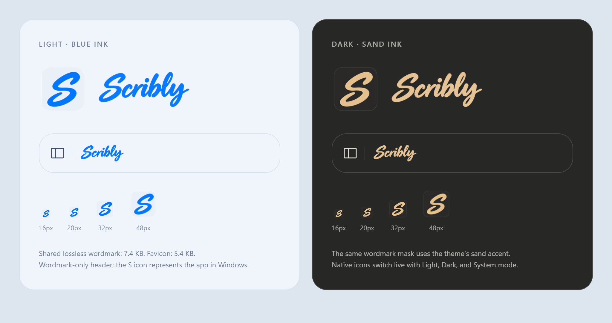

# Scribly branding

Scribly uses brush lettering for its notes and drawing workspace. The app icon
uses the same flowing capital S in blue on pale chrome (light) or sand on
charcoal (dark). The header retains only the wordmark and sidebar toggle.

## Production assets

| Asset | Resolution | Size | Purpose |
| --- | --- | --- | --- |
| `public/scribly-wordmark.webp` | 276×108 | 7,430 bytes | Shared lossless alpha mask; CSS `--accent` supplies blue or sand |
| `public/scribly-icon.png` | 64×64 | 5,371 bytes | Light favicon |
| `public/scribly-icon-dark.png` | 64×64 | 6,398 bytes | Dark favicon |
| `public/scribly-icon.webp` | 128×128 | 11,324 bytes | Standalone light icon for reuse/preview |
| `public/scribly-icon-dark.webp` | 128×128 | 12,040 bytes | Standalone dark icon for reuse/preview |
| `src-tauri/icons/icon.ico` | 16–256, ten sizes | 102,227 bytes | Native light Windows icon |
| `src-tauri/icons/icon-dark.ico` | 16–256, ten sizes | 110,089 bytes | Native dark Windows icon |

The header displays the wordmark at 76×28 CSS pixels, scaled by the existing
app element-size preference. Its encoded resolution supports high DPI without
shipping the large master. No font download, image animation, layout change or
extra header icon is introduced. Both themes share the same wordmark geometry;
CSS tinting changes immediately without downloading another image.

The browser branding payload is about 12.8 KB in light mode or 13.8 KB in dark
mode. Standalone WebP icons are not requested by the app header. High-resolution
masters and this preview are stored here, outside the production public assets.
Legacy Notify assets and their obsolete generators were removed; their history remains in Git.

The running native window assigns both small and large icons from four cached
handles. Light/Dark/System updates retain the existing serialized queue. Version
1.3.10 also updates Windows' separate taskbar-group icon resource and keeps a
stable AppUserModelID for grouping/pinning. The two ICO files are cached under
the app's local-data `branding/<version>` directory once; mode changes do not
rewrite files or decode icons. Window destruction clears its Shell properties.
The Explorer file/installer icon remains the static bundled light icon.

Version 1.3.11 uses the existing 256px frame in ICON_SMALL because Windows 11
can leave its taskbar unchanged for a caption-sized icon. It still caches four
handles for both themes; native downsampling provides the displayed size.
Browser assets, packaged ICO sizes, and mode-switch file writes are unchanged.

Run `scripts/test-native-app-icon.ps1` with PowerShell after a release build.
The test uses an isolated WebView2/notebook profile, checks actual small/large HICON pixels and Shell
resource identity for explicit/system appearance, rapid reversals, and reload.

## Sources and regeneration

- `scribly-wordmark.png`: generated transparent brush master.
- `scribly-icon.png`, `scribly-icon-dark.png`: generated icon masters.
- `scribly.ico`, `scribly-dark.ico`: portable Windows exports.
- `scribly-preview.html` / `scribly-preview.png`: light/dark review, actual header
  size, and icon sizes 16, 20, 32, 48 px.
- [Generation prompts](scribly-prompts.md): exact prompts, built-in imagegen.

Run `python scripts/create-scribly-branding.py` with Pillow to re-export. It
uses a shared crop for the icon pair, antialiased downsampling, real alpha,
lossless WebP and multi-resolution ICOs. Assets require no remote connection.

## Rename compatibility

The display/product name and executable are Scribly 1.3.0. The stable Tauri
identifier `com.still.notes`, PostgreSQL user, browser storage keys, attachment
protocol and serialized drawing/HTML metadata are preserved. Existing
notebooks/backups remain compatible. Exported drawing `source` identifies
Scribly, while the existing metadata key remains readable. Enabled legacy
Notify startup registration is migrated to the Scribly executable on release
launch; diagnostic runs use separate keys and profiles.
