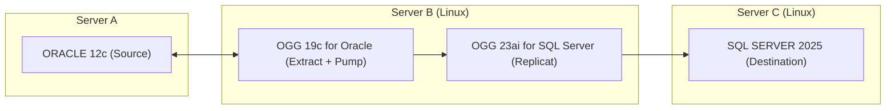

# Architecture boards in Notify

Research and implementation proposal · 2 October 2026

Status: implemented in Notify 1.1.0. This document preserves the original proposal; see [implementation and verification](boards-implementation.md) for the delivered model, tested behavior and remaining limits. The screenshots describe desired behavior; they are not evidence that every tool is available in the published editor package.

## Recommended decision

Embed the open-source Excalidraw React editor inside Notify's central panel. Make a board a first-class folder item alongside notes. Notify owns organization, durable local saving, recovery, backup, and export. Excalidraw owns drawing, selection, styling, connectors, and canvas history.

Add a small architecture interpretation layer: components, explicit boundaries, bound connections, and annotations. Generate Mermaid flowcharts from those relationships deterministically. Keep the Excalidraw scene and its semantic metadata authoritative; the graph and Mermaid are derived outputs, not independently editable databases.

This delivers the drawing experience shown in the screenshots without building a canvas engine. It also makes conversion honest: topology and labels can be portable; exact hand-drawn appearance and arbitrary coordinates cannot be promised.

The editor package offers drawing, bound arrows, undo/redo, image support, pan/zoom, and PNG/SVG/JSON exports. Hosted collaboration and sharing are separate application capabilities. [Excalidraw project](https://github.com/excalidraw/excalidraw)

## Engine choice and tool fidelity

- **Excalidraw — recommended.** Closest fit to the supplied tools and freeform architecture sketches; existing selection and property panels reduce implementation scope.
- **React Flow — fallback for a different priority.** Its node/edge model suits constrained architecture modeling, but matching this freehand editor and styling UI would require substantial additional work. Do not ship both engines in the first version. [React Flow](https://reactflow.dev/learn)
- **tldraw — not the default for this cost goal.** Production usage has license-key requirements; commercial use needs its commercial license. [Current licensing documentation](https://tldraw.dev/sdk-features/license-key)
- **Custom canvas — reject for this release.** Hit testing, text editing, binding, selection, history, accessibility, and export would all become Notify maintenance work.
- **Remote website/iframe — reject as the primary integration.** A bundled React component provides the local data and lifecycle hooks we need. It also avoids relying on a hosted editor's login, storage, and page layout.

Registry checks on the research date returned `@excalidraw/excalidraw` **0.18.1**, Mermaid converter **2.2.2**, and `@xyflow/react` **12.12.0**. Excalidraw 0.18.1 declares React 19 support and an MIT license. This is declared compatibility, not a successful Notify integration test. Pin the chosen release and lockfile; keep notices for the editor, fonts, and bundled dependencies. [Pinned package metadata](https://raw.githubusercontent.com/excalidraw/excalidraw/v0.18.1/packages/excalidraw/package.json), [license](https://raw.githubusercontent.com/excalidraw/excalidraw/v0.18.1/LICENSE)

### What the additional screenshots imply

Use the editor's context-sensitive property panels, rather than implementing a second inspector:

- Shapes: stroke and background colors, fill, stroke width/style, roughness/sloppiness, corners, opacity, and stacking order.
- Text and bound labels: color, available font families, font size, alignment, opacity, and stacking order.
- Connectors: stroke styling, arrowheads, connector type, and bound text where supported.
- Multiple selection: supported shared styling, grouping, alignment, distribution, and duplication.

These controls exist in the pinned release's selection implementation. [SelectedShapeActions source](https://raw.githubusercontent.com/excalidraw/excalidraw/v0.18.1/packages/excalidraw/components/Actions.tsx)

The stable toolbar includes frames, web embeds, laser pointer, and Mermaid import. **Draw-to-shape, bucket fill, and lasso are not present in that release's toolbar.** The current website screenshot therefore exceeds the verified stable package. Do not equate a screenshot with a package feature guarantee. [Pinned toolbar source](https://raw.githubusercontent.com/excalidraw/excalidraw/v0.18.1/packages/excalidraw/components/Actions.tsx)

Proposed initial scope:

1. Retain normal drawing, text, image, grouping, frame, and styling tools.
2. Add Notify's architecture roles and Mermaid export.
3. Include laser pointer if it behaves correctly in the embedded surface; its marks are temporary and must not dirty the board.
4. Defer web embeds: Notify's current offline/CSP model does not support arbitrary external frames. Hide this entry instead of shipping a broken control.
5. Treat text-to-diagram AI and wireframe-to-code as separate integrations. Their services, credentials, cost, and generated-code execution are outside this local drawing feature.
6. Put draw-to-shape, bucket fill, and lasso on an explicit parity checklist. If they are essential for the first release, evaluate an exact prerelease build in the compatibility spike. Do not track a floating `next` tag or silently substitute a partial implementation. A maintained fork is a last resort, with upgrade cost documented.

## Fit to the inspected Notify implementation

The relevant baseline differs from a generic notes app:

- `src/types.ts`: only `Note` exists; `content` is HTML; the workspace has `notes`, `activeId`, and `referenceId`.
- `src/App.tsx`: creation, duplication, archive, search, export, counts, Reference copy, and global shortcuts assume notes. The active Tiptap editor is keyed by item ID.
- `src/newNoteContent.ts`: Copy last note selects the most recently created non-archived note in a folder. Boards must never become that source.
- `src/sidebarOrder.ts` / `src/useSidebarDrag.ts`: array order is persisted; native dragging and keyboard moves are already available.
- `src/useWorkspace.ts`: every update writes recovery synchronously; database saves are queued and debounced 450 ms, with a 5-second safety flush and blur flush.
- `src/recovery.ts`: immutable per-note records plus an atomic manifest; restoration requires string HTML content.
- `src/storage.ts`: browser preview stores the complete workspace in localStorage.
- `src-tauri/src/lib.rs`: one revision-checked JSONB workspace row, with a **20 MiB whole-workspace limit** and note-specific validation.
- `src/importBackup.ts`: validates notes and cleans HTML; board scenes must have a separate validator.
- `src/useFileDrop.ts`: capture handlers intercept file drops before child editors. This must be routed explicitly so canvas image/scene drops work.
- `src-tauri/tauri.conf.json`: strict self-hosted CSP and `dragDropEnabled: false`. Preserve frontend native sidebar drag delivery.
- `src/styles.css`: global element rules could affect embedded editor controls; panel widths respond to breakpoints, element scale, and a saved sidebar width. Menus/dialogs already have later opacity-only overrides; do not diagnose them from earlier keyframes alone.

## Folder and board experience

Proposed user flow:

1. Add a distinct **New board** action beside New note in the sidebar's existing creation area. Keep both identifiable at narrow sidebar widths and larger text sizes; use an accessible creation menu if two readable buttons do not fit.
2. A folder's plus button opens an anchored **New note / New board** picker. The folder is explicit; the global action uses the active item's folder, with Unfiled as fallback.
3. Create an empty board with a new ID and a simple board title. Focus its canvas once loading finishes. The next tool action draws immediately.
4. Display board and note icons in the same folder list and persist their interleaved ordering. Counts include both. Rename Unfiled notes to **Unfiled**; Archive contains both types.
5. Selecting a note opens Tiptap; selecting a board opens Excalidraw. Retain the title, folder location, save feedback, and desktop window controls. Show drawing-specific actions instead of the note formatting/checklist toolbar and word count.
6. Reuse move, duplicate, archive, restore, and permanent-delete flows. Removing a folder moves its boards and notes to Unfiled. Board duplication creates an independent scene and remaps internal semantic references as necessary.
7. Search board titles, live shape labels, connector labels, and boundary names. Exclude deleted elements and binary image data. Retain note HTML search and the correct type-specific summary.

Keep the Reference panel available for a read-only **note** while drawing. Its initial picker remains note-only; copying Reference HTML into a board is disabled with a clear explanation. Boards as Reference previews can follow later. Preserve the user's current Reference and Sidebar preferences on entry; Focus remains the explicit way to enlarge the canvas.

Preserve Ctrl+N for notes, Ctrl+K for search, and Ctrl+S for all pending edits. Do not introduce a board shortcut until conflicts are reviewed. Canvas shortcuts belong to the focused canvas; text fields, note editors, and dialogs retain their own shortcuts. Escape closes the topmost interaction first, then acts on the canvas, then exits Notify Focus mode if still unhandled. Update the existing unconditional app Escape handler accordingly.

## Data model and migration

Prefer one ordered document collection over separate notes and boards arrays. Two arrays would require a third ordering structure to mix them in a folder and could put large board data into the recovery manifest accidentally.

Conceptual shape, to be implemented using the pinned editor's public types:

```ts
type ItemBase = {
  id: string;
  folderId: string | null;
  title: string;
  createdAt: string;
  updatedAt: string;
  archived: boolean;
};

type NoteItem = ItemBase & {
  kind: "note";
  content: string; // existing HTML
  autoTitle?: ExistingAutoTitle;
};

type BoardItem = ItemBase & {
  kind: "board";
  board: {
    schemaVersion: 1;
    engine: "excalidraw";
    elements: PersistedSceneElements;
    appState: PersistedBoardSettings;
    files: PersistedSceneFiles;
    exportDirection: "LR" | "RL" | "TB" | "BT";
  };
};

type WorkspaceV2 = {
  schemaVersion: 2;
  items: (NoteItem | BoardItem)[];
  // Existing folders, theme, appearance, activeId and referenceId remain.
};
```

This is a proposal, not copy-ready code. Do not stringify scene JSON into note HTML or use Mermaid as the only board data.

Migration requirements:

1. Read legacy `notes` workspaces and v1 backups. Map them to `items` with `kind: "note"`, preserving IDs, order, HTML, timestamps, folder settings, automatic titles, and selections.
2. Restore the existing recovery formats against their original revision before normalization. Explicitly migrate legacy drafts; never leave the last unsaved draft unreadable.
3. Add a new item-based recovery manifest and per-item records with discriminated validation. Commit records before the manifest; retain damaged/conflicting legacy data until successful acknowledgment and a recoverable backup.
4. Extend Rust validation and frontend import validation together. Check unique item IDs, folder references, supported kinds/schema versions, finite scene geometry, supported element types, image references, and bounded collection/string sizes. Reject unknown future formats without overwriting them.
5. Keep the same PostgreSQL JSONB row and optimistic revision check. This requires a document-format migration, not a new relational board table for the MVP.
6. New full backups include both types and all image files. Update import recognition: a v2 backup has `items`, whereas current detection looks for `notes`. Remap outer item/folder IDs without corrupting scene bindings. Old Notify releases cannot safely edit v2 workspaces; preserve a pre-upgrade backup.
7. Make note-only operations use a type guard: Copy last note, weekly updates, text export, HTML sanitization, note naming, Reference append, and word counts.

Persist drawing content and chosen board settings. Keep selections, editing overlays, DOM/file handles, collaborators, pointer state, and transient menu state out of durable data. Pan/zoom and current tool preferences can be session/device state. Theme belongs to Notify; changing light/dark/System must not rewrite all boards or recolor their authored elements.

**Image trap:** the pinned editor's `serializeAsJSON(..., "database")` omits binary files. Notify must store files explicitly; portable `.excalidraw` exports must include them. Never assume the database serializer alone makes a complete board backup. [Pinned serializer implementation](https://raw.githubusercontent.com/excalidraw/excalidraw/v0.18.1/packages/excalidraw/data/json.ts)

## Saving, recovery, and scale

Do not feed every canvas `onChange` straight into the existing workspace updater. A pan, selection, or drag can emit frequently; current recovery serialization would otherwise occur on the main thread repeatedly. The callback supplies elements, app state, and files. [Excalidraw props](https://docs.excalidraw.com/docs/@excalidraw/excalidraw/api/props/)

Use a BoardEditor adapter with these responsibilities:

- Retain the newest scene in a ref, tied to its originating board ID and editor generation. Ignore transient-only updates. Detect content changes with element revisions/IDs/order plus file changes and allowed board settings; scene-version sum alone is insufficient.
- Mark content as pending immediately. Coalesce durable checkpoints, starting around 300-500 ms with a bounded maximum interval, and checkpoint at completed gestures/text-edit boundaries when the public API permits.
- On item switch, export, duplicate, archive, backup, Ctrl+S, window blur, and native close: materialize the latest scene **before** invoking workspace flush or reading a snapshot. Include the still-active text edit; test IME composition explicitly.
- Integrate pending board state with the existing save label and beforeunload warning. Display Saved only after database/browser acknowledgment of the latest durable content. Keep dirty state and an exportable snapshot after errors.
- Cancel timers/listeners on unmount; discard late callbacks from the previous board. Do not reload `initialData` from every saved workspace echo or create an `onChange`/`updateScene` feedback loop.
- Retain the active editor during sidebar/reference/focus changes. Undo/redo remains in Excalidraw; semantic role changes must be captured in the same history. In the initial release, history may reset when switching documents; persisted drawings must not.

Retain the current 20 MiB workspace cap for the first release. Add a measured board element limit and raster image limits; start text/vector-first and reject oversized imports/images before changing the board. localStorage quota can be lower than the database cap and differs by environment. Show quota/recovery failures, never silent success.

For larger/image-heavy workspaces, follow up with IndexedDB for browser scenes/recovery and per-board PostgreSQL documents or asset storage. That is a separate storage migration with transaction and recovery design, not simply a raised size limit.

## Reliable drawing-to-Mermaid conversion

### Semantics without restricting sketching

Store a versioned `customData.notifyArchitecture` namespace on applicable scene elements. Roles are **component**, **boundary**, and **annotation**; optional component kinds such as service/database/queue are metadata, not shape recognition rules. Excalidraw supports per-element custom data. [Custom data API](https://docs.excalidraw.com/docs/@excalidraw/excalidraw/api/props/)

Default new labeled rectangles, diamonds, and ellipses to components unless explicitly marked otherwise. A larger enclosing rectangle is not automatically a server. Provide **Mark as boundary**, **Add to boundary**, **Remove from boundary**, and **Exclude from Mermaid** actions, plus a membership/label review in the export inspector.

Use actual element IDs, bound text IDs, and connector bindings. Boundary membership is explicit and board-local; coordinates can suggest candidates but must not silently become authoritative. Frames remain organizational unless deliberately assigned an architecture role. Selection groups are not automatically deployment boundaries.

Derive a temporary graph from the live scene when exporting. No second persisted graph is needed. Semantic edits go through the supported scene/history API; validate duplication, undo, deletion, and import so dangling parent references cannot survive unnoticed. [Scene and history API](https://docs.excalidraw.com/docs/@excalidraw/excalidraw/api/props/excalidraw-api)

### Conversion contract

1. Exclude deleted elements and explicit annotations.
2. Extract components from eligible shapes and their bound labels. Display duplicate labels freely; identity comes from element IDs.
3. Extract explicit boundaries and membership; validate missing parents, multiple memberships, and cycles. MVP supports one boundary level; preserve deeper freeform drawings and report unsupported nesting.
4. Extract edges only from connectors with verified bound endpoints. Preserve direction, double arrowheads, no-arrow relationships, and labels. Resolve reverse-only arrowheads correctly rather than assuming drawing order equals data direction.
5. Report unbound connectors and ambiguous labels/boundaries in a conversion review. Highlight their source elements and provide repair actions. Do not infer relationships from line proximity or silently omit unresolved architecture connections.
6. Preserve self-loops, cycles, disconnected components, and parallel labeled edges. Do not deduplicate different relationships simply because their endpoints match.
7. Emit stable safe Mermaid IDs from scene IDs, with collision checking and deterministic ordering. Escape labels independently using Mermaid-compatible quoting/entities, including quotes, pipes, brackets, Unicode, and reserved words.
8. Target conservative `flowchart LR/TB/RL/BT` syntax: basic shapes, labeled edges, and `subgraph` boundaries. Miro copy uses plain code without Markdown fences. Flatten multiline labels for the portability profile until line-break behavior is verified.
9. Parse and render a preview with a pinned local Mermaid runtime. Syntax success is necessary but does not prove Miro support. Keep conversion diagnostics separate from parser errors.
10. Copy/download only the reviewed output. If unresolved relationships remain, require an explicit partial-export choice with a list of omissions; keep repair/export actions interruptible.

Mermaid supports shape/edge/subgraph definitions and quoted/entity-escaped labels. Its layout determines positions; external edges can also override subgraph direction. [Flowchart syntax](https://mermaid.js.org/syntax/flowchart.html)

The existing official converter runs in the **opposite direction**: Mermaid to Excalidraw. Editable flowcharts and subgraphs are supported; other diagram types become images and some shapes fall back to rectangles. It is useful for later import, not a reverse-export solution. [Converter API](https://docs.excalidraw.com/docs/@excalidraw/mermaid-to-excalidraw/api)

Initial release: drawing to Mermaid export. Later: import a supported Mermaid flowchart into a **new board** with preview and role mapping. Do not claim lossless two-way synchronization. Updating code can relayout a diagram and lose freeform details, so replacement must be explicit and reversible.

### Applied to the supplied architecture

Treat the screenshot as a drawing example, not verification of Oracle/SQL Server product compatibility. Mark each Server A/B/C outline as a boundary, the database/process boxes as components, and the heading as an annotation. Bind each arrow to the intended boxes.

Illustrative portable output for the upper diagram:



This code expresses the apparent visual relationships; it does not validate deployment facts. It has not been pasted into the user's Miro account. For the lower diagram, source and Extract + Pump belong to Server A (AIX); Replicat belongs to Server B (Linux). Membership must therefore come from the actual boundary assignment, not component names.

## Miro copy-and-paste contract

Miro currently documents native Mermaid flowcharts as editable shapes/connectors, including direct paste or **Formats → Diagram → Build with code**. The help page lists Free, Starter, Business, Enterprise, and Education plans, but calls the feature beta with some capabilities still rolling out. Layout is automatic. Free-form conversion breaks Mermaid synchronization. [Miro native Mermaid documentation](https://help.miro.com/hc/en-us/articles/7004628130962-Create-Mermaid-diagrams-Beta)

The older Mermaid app adds diagram images. It is a fallback, not proof of editable-shape transfer. [Legacy app](https://help.miro.com/hc/en-us/articles/37579260117266-Mermaid-diagrams-for-Miro-legacy)

Offer **Copy Mermaid for Miro**, **Download .mmd**, **Export SVG/PNG**, and **Export .excalidraw**. The first preserves supported structure; SVG/PNG preserves a visual reference; `.excalidraw` preserves the editable drawing. Exact positions, font choices, sketch roughness, custom image assets, and layer order are not the Mermaid interchange contract.

Use the user's account for a manual interoperability gate: paste the sample, a labeled edge, a bidirectional edge, and server boundaries; verify editability and code retention. Record unsupported constructs and simplify the export profile accordingly. If native paste is unavailable, try Build with code, then the legacy app/image fallback. No OAuth, Miro API service, or automated publishing is needed for clipboard export. Later direct sync needs a separate conflict and identity model.

## Integration boundaries and local security

- Lazy-load BoardEditor and the Mermaid preview so normal note startup does not eagerly load the drawing/parser bundle. Measure delivered compressed chunks; package unpacked size is not browser startup cost.
- Bundle fonts locally and set `EXCALIDRAW_ASSET_PATH` before editor import. The default font path uses a CDN, which conflicts with offline use and the current CSP. [Self-hosted font instructions](https://docs.excalidraw.com/docs/@excalidraw/excalidraw/installation)
- Keep Notify's theme and shell tokens; limit Excalidraw style overrides to its root. Check global button/input/textarea rules, portal stacking, dropdown positioning, and font loading. Keep Segoe UI for app chrome; drawing fonts are authored canvas content. [Editor styling](https://docs.excalidraw.com/docs/@excalidraw/excalidraw/customizing-styles)
- Route external image/scene drops on the board to its adapter, folder drops to folder import, and note drops to current note behavior. Capture-phase app handlers must not consume canvas events first. Retain native sidebar DnD and keyboard moves.
- Use `handleKeyboardGlobally: false`; app commands must respect already-handled events and modal/canvas ownership. Keep board selection when invoking formatting or architecture actions.
- Keep browser file APIs behind an adapter; use Notify's existing Tauri export command where necessary. Verify clipboard text and raster export in packaged WebView2, not just browser preview. Provide download/select-code fallback on clipboard denial.
- Disable AI and arbitrary embeds initially. Allow only intended safe link protocols. Validate raster assets with limits; do not treat imported SVG/HTML as executable trusted content.
- Run local Mermaid preview with strict security and no clickable callback directives or remote assets. Do not weaken the entire CSP to make an optional embed work. Check any converter iframe/worker requirements against the exact installed release. [Mermaid security settings](https://mermaid.js.org/config/schema-docs/config-properties-securitylevel.html)
- A board error boundary must let the user reopen a note and export the retained raw board data. Editor load/render failure must never overwrite a board with an empty scene.

## Delivery sequence and exit criteria

### Phase 0 — compatibility spike

Use disposable fixture data and an isolated editor harness. Pin the release, verify all requested tool controls, React 19/Vite compilation, offline fonts, CSS isolation, history, image/scene handling, keyboard ownership, and packaged WebView2 clipboard/export. Record the stable/newer-tool gap. Check Miro paste manually. Exit only with a known compatible build and a tested export subset; otherwise choose the fallback or explicitly change tool scope.

### Phase 1 — document model and lifecycle

Implement v2 normalization, discriminated validation, recovery migration, backup import/export, item operations, note-only guards, and mixed sidebar order. Extend Rust validation in the same release. Verify old notebooks/drafts/backups survive upgrade and stale saves still fail safely. No board UI should ship before data round trips work.

### Phase 2 — board MVP

Ship New board, folder creation picker, BoardEditor, bundled styling tools, complete scene/files persistence, save/close integration, board search, archive/restore/duplicate/move, `.excalidraw` import/export, and image export. Keep Reference note-only. Exit with reliable drawing persistence and no regressions to writing or folder behavior.

### Phase 3 — architecture export

Add role/boundary assignment, binding diagnostics, derived graph, conservative Mermaid generator, preview, copy/download, and interoperability fixtures. Exit when the screenshot's two deployment arrangements retain their different memberships and the supported graph exports to editable Miro flowcharts where the native feature is available.

### Phase 4 — optional extensions

Mermaid import into new boards, packaged architecture templates/libraries, board Reference previews, larger asset storage, and verified newer-tool parity. Cloud collaboration, AI generation, code generation, and direct Miro synchronization each require their own scope.

Avoid calendar estimates until the compatibility spike measures package and WebView2 behavior. The main uncertainty is conversion/lifecycle correctness and tool-version parity, not drawing rectangles.

## Validation required during implementation

- Run `npm run build` after frontend changes; select meaningful existing Playwright tests, then add board behavior tests. This planning-only change needs content review, not an app build.
- Migration fixtures: existing notebook, malformed/future format, legacy dirty and clean recovery, revision conflict, backup merge, missing images, and full-quota failures. Preserve IDs, HTML, and order exactly where required.
- Lifecycle: edit → immediate item switch, Ctrl+S, duplicate/export before debounce, close with pending changes, save failure/retry, crash recovery, rapid board switching, active text/IME edits, stale async callbacks, and native database revision conflict.
- Graph fixtures: labeled and duplicate-label nodes, quote/pipe/bracket/Unicode labels, directed/reversed/bidirectional/no-arrow edges, cycles/self-loops/parallel edges, detached arrows, deleted endpoints, decoration, duplicated boundaries, undo, and both screenshot arrangements.
- Interchange: `.excalidraw` round trip includes images and semantic metadata; Mermaid parser preview; Miro native paste and Build with code, plus honest image fallback. A local Mermaid render alone does not pass Miro compatibility.
- UI: tool panels for shape/text/arrow/multi-selection, keyboard focus restoration, canvas/note undo separation, no Reference copy into board, panel toggles without remount, sidebar drag/keyboard transfer, and file drops in all destinations.
- Themes/windows: light/dark/System, increased text/element scale, resized sidebar, 1440×920 and native 850×600 minimum, browser narrow layout, maximized radius, reduced motion/transparency, and canvas coordinates after resize.
- Performance: first note startup with no drawing chunk fetch, first board open, continuous pan/drag, hundreds of labeled nodes/connectors, several boards, save checkpoint duration, image-heavy limit handling, and actual WebView2 responsiveness. Set acceptance budgets from measured baseline rather than inventing FPS or timing claims.

## Interaction and materials review for implementation

This is a proposed screen extension, not a measured feel audit. Response, directness, interruption, spring behavior, spatial consistency, materials, and reduced motion are **[NEEDS INPUT: runtime verification]**. The current stylesheet has immediate press-in overrides and reduced-motion fallbacks; panel grid transitions still need careful resize integration.

The first version introduces no custom spring gesture controller: Excalidraw owns canvas manipulation, and Notify keeps native sidebar dragging. Keep motion out of the live drawing/text surface. New app menus/dialogs use the existing solid panels and instant or ≤100 ms opacity behavior; no bounce or transform keyframes. Immediate press feedback remains causal, while actions activate on click/keyboard semantics.

Use existing solid `--panel`/`--sidebar`/`--chrome`, semantic colors, borders, quiet shadows, panel radii, responsive widths, and modal scrim. No new glass layer behind drawing labels; no new full-screen blur animation. Keep reduced-transparency fallback. Focus restoration and selected tool state must work at intermediate states and after immediate dismissal/reopening.

If panel motion is redesigned as part of implementation, perform the full AGENTS.md A–F review: live-value retargeting, matched left/right paths, editor/canvas resize coordination, one owner per property, runtime reduced-motion support, and measured WebView2 behavior. Do not layer a spring over existing grid transitions.

## Remaining release gates

- [NEEDS INPUT] Confirm native Mermaid availability and tested syntax in the user's Miro workspace; public documentation is not account-level verification.
- [NEEDS INPUT] Confirm whether draw-to-shape, bucket fill, and lasso are first-release requirements. Default proposal: ship the verified stable controls first, with the parity gap visible.
- [NEEDS INPUT] Measure typical board size and image use before changing the current storage limit. Default proposal: vector/text-first, bounded raster support.

These do not prevent planning or the compatibility spike. The recommended first complete feature is: **folder-contained boards, Excalidraw's verified drawing/style tools, reliable local saving and backup, explicit architecture boundaries, and reviewed Mermaid flowchart copy for Miro.**
