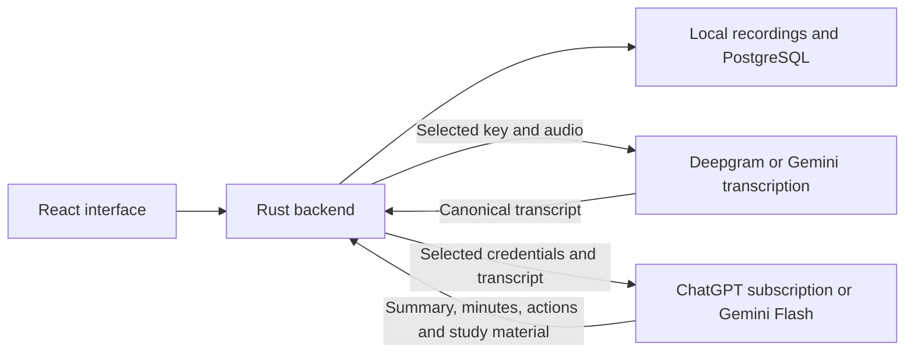

# Meeting notes implementation plan

Current October 7 review supersedes older UI descriptions: meeting documents use latest Summary → Action items → Key points; optional studies/history are separate views. Transcript is a grouped reader with Fix and a shared player docked below it. Panel offers seven default controls; repairs/history/export/save/delete live in its options menu. Providers/models only appear in Settings. Action completion and soft Trash are durable meeting fields/commands; media is reclaimed only through confirmed Clear Trash. See the latest [handoff](meeting-agent-handoff.md) and [verification](../tests/verification.md) for implementation and manual-validation limits.

Date: 2026-10-06

Status: Implemented in the working tree on 2026-10-07. Deepgram, Gemini transcription (including long-session handoff), and ChatGPT/Gemini/OpenRouter analysis still require validation with user-connected accounts before release. See `tests/verification.md` for completed checks and native runtime limits.

### Current Meetings panel organization, October 7

The latest user-requested redesign supersedes the earlier detailed control placement below. The panel follows the meeting's stage: new recording, recording in progress, or saved meeting. New recording shows an optional title, recording consent and Start recording; microphone/call-audio/video, language and live-transcript preferences are under **Recording options**. Existing source defaults and capture permissions remain unchanged. Provider and ChatGPT model choices are consolidated in **Settings → Meeting AI**, opened by the panel's single settings gear; there are no duplicate service/model selectors in recording or note-generation controls. The panel shows the actual selected ChatGPT model, and Account default resolves to the first eligible model returned by the account catalog.

An active recording leads with Pause/Resume, End recording, audio levels and silence status. Saved meetings show title/date/duration once, **Transcript / Meeting notes** navigation and one main notes action: Prepare meeting notes, Finish meeting notes, Resume processing or Regenerate meeting recap. Per-section status is under **Summary, minutes and action items**. Regeneration of a partial/outdated set remains available under **More note options**; it keeps earlier versions. **Ask a question or study** contains the four optional tools and the explicit open-note context choice. **Listen to recording** and **More meeting options** expose playback, title/speaker correction, repeated transcription, export, backup and confirmed deletion. The saved-meeting picker appears under **Other meetings** only when relevant. New recording and backup restore remain secondary actions. Error detail is disclosed once rather than repeated throughout the panel. Transcript and generated content still belong in the central documents; closing disclosures makes no provider request.

Preview inspection covered compact setup/saved states in dark/notebook appearance and the New recording/Back focus path without recording or inference. Native recording, connected-account generation and full keyboard/theme/window acceptance remain unverified for this redesign; see the corresponding verification entry.

## OpenRouter and streaming drafts (2026-10-07)

Meeting AI settings offer **OpenRouter · NVIDIA Nemotron 3.5 Lightning (free)** (`nvidia/nemotron-3.5-lightning:free`). Its API key is verified with `GET /api/v1/key`, stored with Windows DPAPI and excluded from backups. Transcription remains an independent Deepgram/Gemini choice: Nemotron accepts text, not recording audio. New recordings snapshot this request model; explicit regeneration and study requests use the current selection. All seven result kinds, contextual speaker identification and long-transcript consolidation reuse the shared prompts and evidence validators.

The native client calls OpenRouter Chat Completions with SSE streaming and the exact free model. Provider fallbacks are disabled and accepted prompt/completion/request prices are capped at zero. No SDK dependency, paid model fallback or inference call during key verification is introduced. This endpoint does not advertise `response_format`; prompts specify JSON, and finished outputs must pass the existing schema/source validation. HTTP and mid-stream errors show a bounded provider explanation with the supplied key redacted. Free quotas and model availability can still reject a request.

### OpenRouter recovery and subscription context

OpenRouter requests allow exactly 65,000 generation tokens, including provider reasoning. Only `finish_reason: "length"` triggers adaptive recovery: split the affected transcript/findings input in half, retain adjoining turns as non-citable context, and validate each completed child result against its supplied evidence. A durable checkpoint stores only complete, validated output with a SHA-256 key covering the model, prompt, output kind and exact input. Truncated JSON and reasoning remain transient. Split plans are saved too, so resuming does not resend a parent already known to exceed the limit.

Each result-generation run permits at most 48 new provider requests, including at most eight requests for split recovery, three split levels and eight consolidation levels. A run pauses when its request allowance is exhausted; **Resume processing** reuses matching checkpoints and continues unfinished work, including the original question and optional note context. Authentication, quota, content-filter, connection and invalid-output errors do not trigger automatic retry. Transcript/name edits, retranscription, title changes and different task inputs invalidate the relevant saved job. Local cancellation guards prevent late checkpoint writes from replacing a canceled job's state. Checkpoint storage is bounded to 512 entries and 8 MiB; it travels with validated meeting backups, excluding API keys.

Long-meeting findings are merged in bounded groups and then consolidated into one final result. Original source IDs, uncertainty, distinctions between proposals and decisions, and speaker-name provenance remain part of validation/prompting. Outputs recovered as separate pieces require a final whole-group consolidation before being marked complete. If speaker naming fails, retain existing names/numbered labels and show **Speaker names need review** rather than block the recap. Completed analyses remain independent of the recovery state and are preserved on failure.

ChatGPT subscription and Gemini analysis requests bypass this recovery pipeline and its partition, token and retry caps. Both speaker interpretation and each requested output receive the complete stored transcript in a single request. ChatGPT Responses omit `truncation` and `max_output_tokens`, both unsupported on the subscription route. No application-side transcript partition or truncation is applied. Gemini generation omits `maxOutputTokens`, retaining Google's model default. The selected model/account controls its actual context/output limits; this does not make either provider unlimited. Existing local transcript, backup, result-format and note-context storage limits remain in force. Audio transcription session/duration limits are independent of this text-analysis change.

End recording opens the same-folder summary immediately after local capture finalization. OpenRouter sends temporary text previews to the main summary document, including manual study/question results. The preview is visibly marked as a live draft and updates at most every 200 ms plus a final flush. SSE framing buffers split UTF-8, handles CRLF, multiline data, comments, final usage frames and errors, and requires a successful completion plus `[DONE]`. Only display text is extracted from incomplete JSON; it is never appended to the saved note. The complete section saves through existing evidence validation and the note writer. Completion, failure or cancellation clears the preview; previously saved sections and user writing remain. Long meetings show the current part/consolidation stage. Switching notes does not stop processing or move focus back; no automatic scrolling or simulated typing is used. The loading spinner stops under reduced motion while its label remains visible.

Gemini remains available with funding guidance: its key needs available quota and, for paid usage, active billing with sufficient prepaid balance when applicable. Connecting a key does not check its balance. [Google billing documentation](https://ai.google.dev/gemini-api/docs/billing) excludes new GCP $300 welcome credits from Gemini API/AI Studio usage. This distinction does not establish the cause of any particular HTTP 400.

The OpenRouter choice displays NVIDIA's free-endpoint data-use notice before use: do not send confidential meetings or personal data; requests are logged and may improve NVIDIA services. See the [model and notice](https://openrouter.ai/nvidia/nemotron-3.5-lightning:free), [streaming protocol](https://openrouter.ai/docs/api_reference/streaming) and [free quota documentation](https://openrouter.ai/docs/api_reference/limits). Provider-backed quality, SSE runtime and native cancellation still require user-account validation. No tests or real inference requests were run for this update, per the user's instruction.

## Using the implemented feature

1. Connect Deepgram and ChatGPT in **Settings → Meeting AI**. Keys and tokens are protected with Windows DPAPI in the notebook's local data directory; backups exclude them.
2. Choose **Start meeting** from a folder's options. It creates a blank, editable `Introduction · Oct 7, 2026 · Meeting` note in that folder and opens the existing meeting side panel. Folder templates and copy-last-note settings do not populate this blank meeting note. Choose microphone/system audio and optional local video, confirm participant permission, then **Start recording**. Final transcript segments are appended to this note (Gemini Live has no speaker labels and its times are approximate); mutable interim text appears beneath it. Writing, selection and note switching remain available. For a live-capable model, turning live transcription off records locally without sending audio. Gemini 3.5 Transcribe instead uploads the saved recording automatically after stop, within its 30-minute diarization limit.
3. Alternatively, import WAV, MP3, M4A, FLAC, OGG, WebM or MP4. Files are copied into managed local storage. MP4/WebM can also be played as video locally.
4. **End recording** saves the audio and completes the live stream. Three minutes without detected speech also stops and saves, displays a reminder, requests a Windows notification and plays the supplied sound. Local WebRTC VAD monitors both audio tracks, including offline capture; paused time is excluded. Background noise or music can affect speech detection. A separate `Introduction · Oct 7, 2026 · Meeting Summary` note is created in the same folder. The request provider selected when recording starts prepares summary, chronological minutes and actions sequentially; each completed section is saved immediately. Transcript and summary notes have distinct icons and links between them. Failures retain audio, transcript and earlier results, with no automatic paid retry.
   For an imported/offline recording or an interrupted live connection, explicitly choose **Transcribe & label speakers**. Choose Deepgram Nova-3 or Gemini 3.5 Transcribe under Transcription settings; this uploads the saved audio using that provider’s account quota. Gemini speaker transcription is limited to 30 minutes. A retry replaces the meeting-store transcript and updates generated paragraphs in the linked note. Personal writing stays intact. Generate missing AI sections in the linked summary note using Prepare / Complete meeting recap. Completed sections are retained; only missing or outdated sections are requested.
5. Read the transcript in the main document. Open **Meetings** from the topbar and choose **Review transcript** in the side panel to correct a timestamped segment. Before AI analysis, conversation context can infer names from introductions, named replies and team references. Strong associations label the transcript; uncertain matches keep **Speaker 1**, **Speaker 2**, etc. Choose **Review speaker names** in the side panel to inspect the rationale, spelling variants and supporting turns, then correct or use a suggestion and save. The existing meeting-details pencil also lets you enter known names. Corrections synchronize generated paragraphs with the linked note. If you edited a generated paragraph yourself, that paragraph is kept as personal writing beside the corrected transcript. Unchanged legacy transcript paragraphs are adopted automatically; unmatched older text is preserved. Speaker labels/inferred names do not verify identity or isolate each person's voice into a separate file.
6. Open **Meetings** from the topbar. The side panel contains Transcript / Summary & AI notes navigation, meeting status/errors, **Meeting recap**, **Explore this meeting** and **AI options** alongside recording/playback/transcription settings. The central document contains the note title/date, transcript or generated results, and personal writing. **Meeting recap** shows the status of the automatic Summary, Meeting minutes and Action items. A single Prepare / Complete meeting recap action is available only when sections are missing or outdated; it skips current completed sections and saves each success before requesting the next. Once any recap result exists, **Regenerate meeting recap** appears directly beneath the recap status, including for partial or outdated recaps. It explicitly creates a fresh summary/minutes/actions set using the provider/model selected in AI options, retaining earlier results for comparison. The button is disabled while processing or when the recording/transcript/provider is unavailable. **Explore this meeting** offers four explicit optional actions: Study notes, Flashcards, Quiz and Ask a question. Selecting one reveals its explanation/question input and Generate/Get answer button; nothing is generated by selecting a tool. **AI options** contains the independent request provider, ChatGPT account model when selected, and optional note context for these study tools. Note context is available only for the active note linked to that meeting; unrelated notes are excluded. Archived/Trash meeting notes do not expose generation controls. Provider selection alone never generates or uploads content. **Refresh models** retains eligible selections; GPT-6.1-Sol appears only when returned by the account catalog. All results save in the summary note in the main document. Successful explicit generation opens the summary only if the user has not switched notes during the request. Unchanged generated sections previously inserted in a transcript move after successful summary saving; edited sections and personal writing remain intact. Earlier results retain model/date metadata and transcript corrections show a stale-results reminder.
7. Export Markdown for text. Export a separate versioned `.scribly-meeting` ZIP for a complete meeting backup, with an explicit audio/video inclusion choice. Restore creates an independent meeting with a new ID and does not start paid processing. Notebook backups include the transcript and summary notes with their metadata, but exclude the separate meeting store and recordings.
8. Delete a meeting only through its own permanent-delete confirmation. Deleting or replacing a notebook note does not delete its recordings; the Meetings list remains available. Interrupted processing is marked failed without automatic chargeable retries. Use **Recover saved audio** after a recording interruption.

The browser preview has labeled sample data and supports transcript edits, separate transcript/AI note documents, corrections, export and normal note editing. It does not simulate successful live provider requests. Native capture and credentials require the installed Windows app.

Implementation modules: `src/MeetingPanel.tsx`, `src/MeetingAIControls.tsx`, `src/MeetingSettings.tsx`, `src/useMeetings.ts`, `src/meetings.ts`, `src/meetingNotes.ts`, `src/useMeetingNoteWriter.ts`, `src/MeetingNoteStatus.tsx`, and `src-tauri/src/meeting_{audio,auth,backup,gemini,live,providers,recorder,silence,video}.rs` plus `meetings.rs`. Canonical meeting metadata is separate from notebook autosave in `scribly_meetings`; readable transcript/summary text and progress metadata use normal notebook saving. Managed media stays under `meetings/<id>/`.

Current bounds: four hours per new native recording, 2 GiB per imported/media file, 24-hour transcript timestamps, and bounded provider output/history. Native video uses Windows Graphics Capture and Media Foundation encoding; unavailable encoders or changed capture dimensions produce an error while recoverable audio stays local. MP4 recovery after a process crash is not guaranteed; PCM audio recovery is the supported recovery path. Long-session drift, microphone quality, echo handling and real provider quota/refresh behavior still need representative hardware/account acceptance testing.

Offline speech detection uses WebRTC's aggressive mode and requires 400 ms of sustained speech to avoid resetting the timer for brief notification sounds. Silent padding is also supplied to the detector so separate sounds cannot accumulate across silent gaps. Very short isolated offline utterances may not reset it; live Deepgram speech events and recognized words reset the timer immediately. Three minutes always means recording time since the last detected speech, excluding pauses.

Verified on Windows WebView2 with isolated local PostgreSQL profiles: system-loopback recording, window video capture and playback, pause/resume, writing and autosave during capture, persistence after restart, PCM recovery after forced termination, and independent meeting deletion. The full silence case stopped at 180.008625 seconds of unpaused audio, displayed the reminder, materialized the supplied sound and created the linked same-folder summary note. Missing-provider failures retain recordings and reviewed transcripts. Native checks make no paid provider calls; OS notification audibility remains a manual check.

For the native check, build the debug app with `cargo build --manifest-path src-tauri/Cargo.toml --locked`, serve the built frontend at the configured debug URL with `node node_modules/vite/bin/vite.js preview --host localhost --port 1420 --strictPort`, then run `powershell -NoProfile -ExecutionPolicy Bypass -File scripts/test-native-meetings.ps1 -Silence`. The optional `-Silence` case waits the real three minutes using silent loopback capture. The script uses a separate diagnostic profile and never opens the production notebook or accounts. Pause and End recording use separate request state so provider requests do not disable capture controls.

The implementation sequence below is updated for the folder-first workflow requested on October 7. Account-backed service validation remains outstanding; sample data and local checks do not establish provider quality or eligibility.

## Architecture and decisions

Notify records and stores meetings locally. Deepgram or Gemini transcribes audio. ChatGPT subscription models or Gemini 3.8 Flash analyze the resulting text, independently of the transcription choice. All integration code runs inside the Tauri desktop app; we will not host a server.

- Rust owns recording, credentials, network requests, persistence, and background jobs. React displays state and issues commands.
- Use Deepgram Nova-3 streaming transcription over a Rust-owned WebSocket, with interim results, final word timestamps and `diarize_model=v1`. Stream the same aligned mono 16 kHz PCM used for recovery. Recorded-audio transcription remains available as an explicit alternative. Do not automatically reconnect or upload again after uncertain completion.
- Use the official Sign in with ChatGPT public-client flow and direct Responses API calls. Do not bundle the Codex CLI, a Python runtime, or local AI models for this version.
- Users provide their own Deepgram and/or Google AI Studio API key. Their account pays transcription charges after any eligible starter credits are exhausted. Starter credits are not a recurring allowance.
- ChatGPT analysis uses the signed-in user's eligible allowance and requires internet access. Recording and playback remain local.
- Diarization means labeling who spoke when. It does not isolate individual voices into separate audio files or establish verified names.
- Subscription-backed audio/video input and transcription are currently unsupported by the documented OpenAI flow. Send transcript text and, later, selected images supported by the chosen model.

## Gemini provider choices and long live meetings

| Transcription choice | Behavior | Important limits |
| --- | --- | --- |
| Deepgram Nova-3 | Live finalized text and speaker IDs; saved-audio transcription | Requires a Deepgram key/credit |
| Gemini 3.5 Transcribe Live | Continuous live text in the same meeting note | No diarization or word timestamps; displayed times are approximate |
| Gemini 3.5 Transcribe | Automatic saved-audio transcription after stop; word times and speaker IDs | Up to 30 minutes with diarization/timestamps; up to 8 speakers, with 3+ speaker diarization experimental |

Both transcription services feed the same canonical meeting segments and revision tracking. Request handling is independently **ChatGPT subscription** (account catalog and existing reasoning policy) or **Gemini 3.8 Flash**. All seven output kinds and the contextual speaker evidence pass share the existing evidence-bound prompts and source validation. A nondiarized Gemini Live transcript is skipped by the speaker-ID naming pass: assigning one name to its single unknown ID would mislabel multiple people.

Google integration uses Rust-owned HTTPS/WebSockets without an additional hosted server or SDK dependency. Flash uses the documented `generateContent` JSON response contract; recorded transcription uses `interactions` with verbatim speaker diarization and word annotations. API calls disable interaction storage. Audio uploads use the Files API and streamed file bytes. Uploaded files acknowledged by Google schedule a deletion request after completion, failure or cancellation; an interrupted unacknowledged upload or failed deletion can remain until provider expiry. Keys and provider preferences are stored together in Windows-protected credentials and are excluded from exports. Selected transcription model/language and analysis model provenance survive meeting backup/restore; older records retain defaults.

Gemini Live's ten-minute session cap is handled by a **planned parallel renewal**, not an automatic retry of failed paid audio:

1. Stream aligned mono 16 kHz PCM to the active WebSocket while recording both local recovery tracks continuously.
2. Around minute nine, initiate and authenticate the next WebSocket in a separate task while the active socket continues receiving new PCM.
3. Wait for the replacement's setup acknowledgement. Signal audio-stream end on the old socket and route subsequent chunks to the new one, keeping the shared capture cursor unchanged. No audio is replayed into both sessions.
4. Drain old-session final text while receiving new-session text. Buffer successor finals until the old tail finishes, then persist in chronological order with stable segment IDs. Require end acknowledgement with no unresolved interim text, then a quiet interval or clean server close; final transcription can arrive after turn completion.
5. Keep capture-relative offsets across renewals and append all sessions to the same note. Stop cancels unfinished handshakes and drains active sessions. A failed renewal, stream or finalization keeps local recordings and completed text, marks the live transcript incomplete, and requires an explicit recovery transcription.
6. After the meeting ends, the selected request provider processes the full saved canonical transcript in bounded sections and consolidates evidence-backed results. Session resets therefore do not create separate summary notes. A split utterance or recognition context at a socket boundary can still affect transcript quality; retained audio remains the recovery source.

This removes the per-socket ten-minute recording limit, subject to account quotas, network conditions and Scribly's existing four-hour recording limit. Unit tests cover late-tail ordering, finalization state, no duplicate buffer flush, and the aligned PCM cursor; they do not establish real Google session behavior or hour-long accuracy. Test a real meeting longer than ten minutes with the user's connected account before release.

## First-release scope

- Import an existing audio recording.
- Record microphone and system audio, with device selection, pause, resume, and stop.
- Recover interrupted recordings and retry failed processing.
- Read a timestamped transcript and rename speakers.
- Play recordings in the meeting settings panel.
- Generate summaries, decisions, action items, study guides, flashcards, and quizzes.
- Ask questions grounded in the recording's transcript.
- Save every generated result to a separate linked summary note without overwriting existing writing.

Optional screen/window video capture and live transcription are implemented. Video stays local; only audio goes to the selected transcription service. Imported MP4 requires Deepgram; native video recordings have a separate WAV audio track usable by Gemini. Calendar integration, meeting bots and isolated voice extraction remain outside this release.

## 1. Prove the service integrations

Before building the full interface:

1. Transcribe a short imported recording through Deepgram using a user-supplied key.
2. Request diarization and utterance timestamps and inspect the actual response.
3. Complete ChatGPT sign-in from a packaged Windows app.
4. Retrieve account-specific available models and send the transcript for analysis.
5. Validate token refresh, unavailable models, exhausted transcription credit, and subscription-limit errors.
6. Confirm that no developer-hosted service or shared embedded credential is involved.

Exit condition: a real recording produces a speaker-labeled transcript and summary through the intended credentials. If subscription eligibility cannot be confirmed, keep that limitation visible rather than claiming the integration works.

## 2. Add durable meeting storage

Keep media and canonical timestamped transcript data in the separate meeting store. Append readable transcript paragraphs to the linked notebook note, and generated sections to a separate summary note. Persist paragraph progress and analysis IDs atomically with note HTML to prevent duplicates after reload. Store media under the app data directory and metadata in the existing local PostgreSQL database.

| Record | Information |
| --- | --- |
| Meeting | ID, linked note ID, title, creation time, duration |
| Media | Managed file references, source tracks, format, recovery manifest |
| Transcript | Timestamped segments, speaker IDs, text, revision |
| Speaker | Provider speaker ID, user-assigned or inferred display name, inference provenance (name/team, spelling variants, strong/tentative evidence category, source IDs, explanation, transcript revision) |
| Analysis | Result type, generated content, source revision, selected model |
| Processing job | Stage, attempt, provider request ID when available, error |

Implementation steps:

1. Add database migrations and typed Rust/TypeScript representations.
2. Add commands to create, read, update, and delete meeting records.
3. Persist recording status separately from processing status. A saved recording remains saved even when transcription fails.
4. Persist processing stages such as queued, uploading, transcribing, analyzing, completed, failed, and canceled.
5. Recover interrupted jobs at startup without blindly resubmitting chargeable requests.
6. Integrate media with Trash, permanent deletion, exports, and backup/restore. Offer an explicit media inclusion choice; never silently omit recordings from a purported complete backup.
7. Validate managed file boundaries and avoid putting large media blobs into workspace JSON.

## 3. Implement connections and credential storage

Add a Meeting AI settings section with Deepgram key entry, connection check, disconnect, Continue with ChatGPT, account information, and model selection.

ChatGPT sign-in steps:

1. Prepare the documented host identity and client registration state.
2. Start a temporary loopback callback listener on `127.0.0.1`.
3. Generate fresh OAuth state, OIDC nonce, and PKCE verifier/challenge.
4. Open the system browser on OpenAI's authorization flow.
5. Validate the callback and exchange the authorization code in Rust without a client secret.
6. Validate the ID token, account identity, and granted plan-usage scopes.
7. Save the issued client registration and credentials securely; close the listener.
8. Refresh credentials as needed and handle expiry, revoked access, cancellation, and disconnect.

Use Windows-protected credential storage. Do not put secrets in React state exposed through general app data, browser storage, notebook exports, logs, or backups. Keep an existing account active until a replacement sign-in has fully succeeded.

Use the current account's available model catalog rather than assuming subscription entitlement from a hard-coded model name. Show that audio goes to Deepgram and transcript text goes to OpenAI before users enable processing.

Model selection starts with the first selectable model in the server-ordered account catalog, labeled Default. Automatic recaps use that model when no explicit model was supplied; refresh preserves an eligible manual selection. All meeting Responses requests, including speaker identification and consolidation, use `reasoning.effort: low` for `gpt-6-astra` and `reasoning.effort: high` for `gpt-5.6-sol`. Other models retain their provider reasoning default. AI options shows the effective reasoning policy alongside the selected model.

## 4. Build imported-recording transcription

1. Validate supported media types and configured size/duration limits against current provider documentation.
2. Copy the imported file into managed local storage and create its meeting record.
3. Persist a transcription job before starting network work.
4. Upload audio through Rust to Deepgram Nova-3 with diarization and utterance timestamps enabled.
5. Normalize provider output into timestamped segments and stable speaker IDs scoped to the transcript.
6. Commit the transcript before displaying completion.
7. Provide cancellation, clear errors, and explicit retry controls.

If request completion is uncertain after a network failure, do not silently replay the upload and potentially charge twice. Preserve the recording and explain the uncertain state. Process the entire recording in one request where supported to preserve speaker consistency; splitting requires explicit speaker reconciliation.

Exit condition: imported audio can be transcribed, reopened after restart, played, and retried without losing existing results.

## 5. Implement native audio recording

Use Windows WASAPI through Rust for microphone and playback-device capture.

1. Enumerate supported input/output devices and add selection plus level meters.
2. Capture both sources on a dedicated native worker, independently of React and note saving.
3. Timestamp sources against a shared recording timeline.
4. Preserve separate source tracks locally.
5. Resample and synchronize sources, including clock drift, when producing the transcription mix.
6. Write recoverable chunks progressively with a persisted manifest.
7. Define pause/resume timeline semantics consistently for playback and transcript timestamps.
8. Finalize files on stop and enqueue transcription only when the user requests it or enables that behavior.
9. Detect interrupted sessions on startup and offer recovery.

For the initial economical transcription path, create one synchronized mixed audio file and let Deepgram label speakers. Separate-channel processing can be added if tests demonstrate a worthwhile accuracy improvement; it can increase billable duration.

Handle microphone permission failures, device removal, output-device changes, sleep, disk-full conditions, app exit, and worker failure. Never display Recording when capture has stopped unexpectedly. Keep recording controls available when navigating between notes.

Test headphones and speakers. Playback entering the microphone can duplicate remote speech, so echo handling is a capture-quality requirement. Do not assume mixing alone resolves it.

## 6. Add transcript analysis and study tools

Send timestamped transcript segments, speaker names with their user/inferred origin, and user-selected notes through the subscription-backed Responses API.

| Action | Output |
| --- | --- |
| Meeting summary | Overview, decisions, open questions |
| Meeting minutes | Chronological discussion, contributions and decisions with source timestamps |
| Action items | Task, owner if known, deadline if stated, supporting segment |
| Study guide | Concepts, explanations, glossary |
| Practice | Flashcards, questions, answers, source references |
| Ask this recording | Answers grounded in the transcript with references |

Implementation steps:

1. Define typed result schemas and validate generated content before persistence.
2. Request source segment references for factual claims, decisions, and action items.
3. Leave unknown owners and deadlines unspecified; do not invent them.
4. Treat transcript text as untrusted source material, not instructions to execute tools or change application behavior.
5. Send requests using the documented subscription route and its required parameters.
6. For transcripts beyond model limits, analyze timestamped sections and combine results while retaining evidence references.
7. Save analysis as a separate draft associated with the source transcript revision.
8. Mark results outdated when transcript text or speaker mappings change.
9. Save all generated results into the separate linked summary note through the normal notebook save path. Preserve existing writing and record analysis IDs to prevent duplicates.
10. Support cancellation and retry without deleting completed results.

The implemented prompt builder is `analysis_instructions` in `src-tauri/src/meeting_providers.rs`. Each task has a separate brief and a shared evidence/output contract, informed by [OpenAI's prompt engineering guidance](https://developers.openai.com/api/docs/guides/prompt-engineering). Transcript text, titles and optional note context are untrusted data. Context may clarify terms, but cannot establish new meeting facts. New speaker names are inferred only by the dedicated evidence pass described below; later tasks use supplied labels. Dates, decisions and commitments must not be invented. Ambiguous speech and disagreement remain qualified.

- **Summary:** up to eight concise items: overview first, material findings and outcomes by topic, explicit decisions and recorded open points when present. Omit filler and avoid treating proposals as consensus.
- **Minutes:** up to 30 chronological topic entries, starting with an exact supplied source timestamp. Merge adjacent turns and preserve later developments without inventing attendance or an agenda.
- **Actions:** up to 30 distinct commitments or explicitly assigned tasks. Use verb-led descriptions; owners and deadlines require explicit evidence. Keep relative deadlines as spoken. Suggestions, fictional events and general advice are not commitments; no commitments produces an empty list.
- **Study notes:** up to 12 grounded definitions, distinctions and relationships; examples and misconceptions only when supplied by the recording.
- **Flashcards:** up to 15 focused question/answer pairs, one concept per card, with citations supporting the answer.
- **Quiz:** up to ten answerable questions with answers and short explanations. Progress from recall to understanding; application questions require sufficient recorded evidence.
- **Questions:** up to six direct answer items with necessary qualifications. Insufficient evidence produces an empty result instead of a guessed answer.

These are upper limits, not targets. Output uses the recording's main language, or the question's language for Q&A. Every item requires supporting segment IDs and plain text in the existing JSON contract; non-action owners/deadlines are null. Long recordings are analyzed in bounded sections, with references validated against the section actually supplied, then consolidated without adding facts or promoting proposals to agreements. The existing parser validates JSON, sizes and source references before saving. Prompting guides behavior; it does not prove factual correctness or enforce an API-level JSON schema. Connected-account output quality still needs evaluation against representative real recordings, including lessons, meetings with no commitments and ambiguous speech.

Before the first analysis of a transcript revision, `identify_speakers` uses `SPEAKER_INSTRUCTIONS` to interpret participant names from the conversation. This is an additional request to the selected analysis provider for each bounded transcript section, plus consolidation for multiple sections with candidates. It is skipped if every voice already has a manually supplied name or that revision has already been examined. Adjacent context overlaps section boundaries so a named address and its reply can be considered together.

The prompt explicitly distinguishes the caller, addressee and third-party mentions. A self-introduction or corroborated named-response pattern supports a strong association; adjacency alone does not. Similar-sounding spellings such as Mark/Marc are possible aliases only with compatible repeated context. Explicit team/role qualifiers distinguish namesakes, for example **Mark (DBA)** and **Mark (Development)**. Quoted names, interruptions, ambiguous exchanges and contradictory clues remain tentative or unknown. This pass never merges diarization IDs, rewrites raw transcript text or verifies identity from a voiceprint.

Strong associations populate display names with retained inference provenance; tentative candidates stay suggestions. Duplicate indistinguishable inferred names are downgraded to tentative. **Review speaker names** in the summary opens existing meeting details, showing the rationale, spelling variants and supporting transcript turns. Users can correct names or apply a tentative suggestion before saving. Changed names become human corrections and future inference cannot overwrite them. Names changing automatically increment the transcript revision, so prior results remain available but become outdated; recap recovery requests every missing section of the resulting revision. Retranscription clears the old mappings/provenance; transcript edits trigger a fresh pass on the next analysis. Old records and backups remain readable through optional/defaulted metadata fields. AI confidence categories describe evidence strength, not calibrated identity probabilities; real-recording evaluation is still required.

## 7. Integrate the notebook interface

Build focused components for recording controls, transcript/speaker editing, playback, generated-result review, and connection settings.

- Keep the central editable document primary.
- Add **Start meeting** to each folder menu. Persist the blank transcript note before opening a provider connection. Final segments append only to that recording's linked note, even when a different note is selected.
- After stop, create one linked summary note in the source folder. Persist `meeting.segmentCount` and `meeting.analysisIds` with their appended HTML, preserve user writing and exclude automatic appends from undo history. Keep the canonical transcript available for recovery even when a linked note is in Trash.
- Keep transcripts, generated content and personal writing in the two linked main documents. Put meeting status/navigation, recap generation/regeneration, optional study tools and AI options in the Meetings side panel with recording, metadata, playback, transcription and backups. Retain normal Reference behavior when switching modes; do not duplicate transcript/result readers in the side panel.
- Preserve editor instance, selection, focus, scroll, and autosave during recording and processing updates.
- Keep recording status separate from note-saving status.
- Reuse current theme tokens, Phosphor icons, geometry, and keyboard conventions.
- Avoid decorative motion during typing. Any new motion must support reduced motion and immediate interruption where applicable.
- Use sample data to demonstrate the interface in browser preview. Clearly label native capture and Windows credential handling as desktop-only.

Reinspect the relevant implementation before editing. Primary integration points include `src/App.tsx`, `src/NoteEditor.tsx`, `src/styles.css`, `src/storage.ts`, `src/useWorkspace.ts`, `src/types.ts`, and the existing Rust command, database, attachment, and backup modules. Keep new meeting functionality in focused modules rather than expanding the app shell into a processing engine.

## 8. Add optional screen/window video

After the audio workflow is reliable:

1. Add native Windows screen/window selection and capture.
2. Use hardware encoding where available, with an explicit supported fallback.
3. Synchronize video with the audio timeline, including pause/resume.
4. Persist recoverable media and finalize interrupted recordings.
5. Support local playback and seeking from transcript timestamps.
6. Send the audio track to Deepgram, not the full video unless explicitly needed and supported.

Raw video is not sent through the ChatGPT subscription integration. A later extension may submit user-selected slide frames as images to a compatible model.

## 9. Validate and release incrementally

Consult `tests/verification.md` before running checks. Add meaningful regression tests only for affected critical behavior.

| Area | Critical checks |
| --- | --- |
| Persistence | Recording/job recovery, transcript saving, backup/restore, deletion |
| Authentication | Callback validation, identity/scopes, refresh, cancellation, disconnect |
| Provider processing | Quota failures, malformed responses, interrupted uploads, duplicate-submission prevention |
| Native capture | Microphone plus remote audio, device changes, pause/resume, long-session synchronization |
| Notebook | Writing/autosave during processing, note navigation, source references |
| Interface | Keyboard access, applicable themes, reduced motion, responsive layout |

Use existing Playwright tooling for affected UI cases with mocked provider responses. Validate native recording and real service access separately; browser tests do not establish WASAPI or OAuth behavior. Keep paid real-provider tests explicit and bounded.

Run applicable Cargo checks and targeted tests for Rust changes. Run `npm run build` once after the final relevant frontend edit. Record date, working-tree scope, command, result, and limits in `tests/verification.md`. Use ignored test-output directories for temporary evidence.

Release in this order:

1. Service proof with a real imported recording.
2. Durable imported-recording workflow, transcript review, and summary insertion.
3. Native microphone/system recording and recovery.
4. Study tools and transcript-grounded Q&A polish.
5. Optional screen/window video.

## Acceptance criteria

- No developer-hosted server is required.
- Users connect their own Deepgram account and eligible ChatGPT subscription.
- Recording survives processing failures, and recoverable audio is retained after interruptions.
- Speaker-labeled transcript segments support playback navigation and user renaming.
- Generated content is traceable, editable, and never silently overwrites notes.
- Credentials remain outside exported notebooks and logs.
- Existing editing, saving, recovery, and Reference workflows remain intact.
- Provider eligibility, runtime behavior, and untested native limitations are reported honestly.

## References

Documentation reviewed during planning on 2026-10-06. Recheck integration contracts, availability, and rates before implementation.

- [OpenAI registration and desktop sign-in](https://developers.openai.com/siwc/token-sharing-open-source/sign-in)
- [OpenAI models and inference](https://developers.openai.com/siwc/token-sharing-open-source/models-and-inference)
- [OpenAI subscription-flow limitations](https://developers.openai.com/siwc/token-sharing-open-source/preview-limitations)
- [Gemini Live transcription](https://ai.google.dev/gemini-api/docs/live-api/live-transcribe)
- [Gemini transcription models and limits](https://ai.google.dev/gemini-api/docs/models/gemini-3.5-transcribe)
- [Gemini recorded-audio transcription](https://ai.google.dev/gemini-api/docs/transcribe)
- [Gemini 3.8 Flash](https://ai.google.dev/gemini-api/docs/models/gemini-3.8-flash)
- [Google Files API](https://ai.google.dev/gemini-api/docs/files)
- [Deepgram speaker diarization](https://developers.deepgram.com/docs/diarization)
- [Deepgram streaming protocol](https://developers.deepgram.com/reference/speech-to-text/listen-streaming)
- [Deepgram finalization](https://developers.deepgram.com/docs/finalize)
- [WebRTC VAD Rust bindings](https://github.com/kaegi/webrtc-vad)
- [Deepgram pricing](https://deepgram.com/pricing)
- [Windows WASAPI loopback recording](https://learn.microsoft.com/en-us/windows/win32/coreaudio/loopback-recording)
